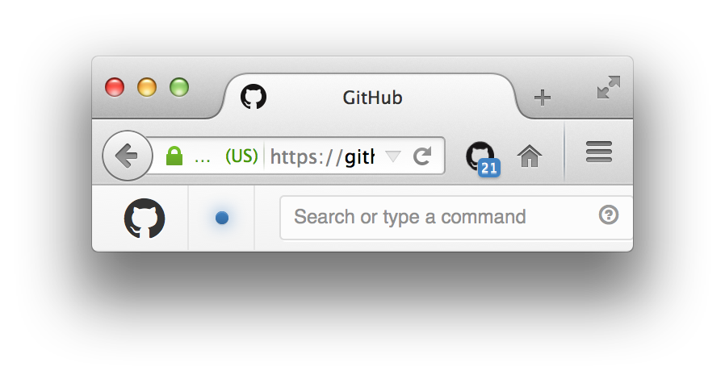

# GitHub Notifier for Firefox

> Extension that displays your GitHub notifications unread count

## Install

Install from the [Firefox Add-ons site](https://addons.mozilla.org/en-US/firefox/addon/github-notifier/).

## Related

Also available on [Chrome](https://github.com/sindresorhus/github-notifier-chrome), [Opera](https://github.com/sindresorhus/github-notifier-opera), [Safari](https://github.com/sindresorhus/github-notifier-safari).

## License

[MIT](http://opensource.org/licenses/MIT) © [Sindre Sorhus](http://sindresorhus.com)
